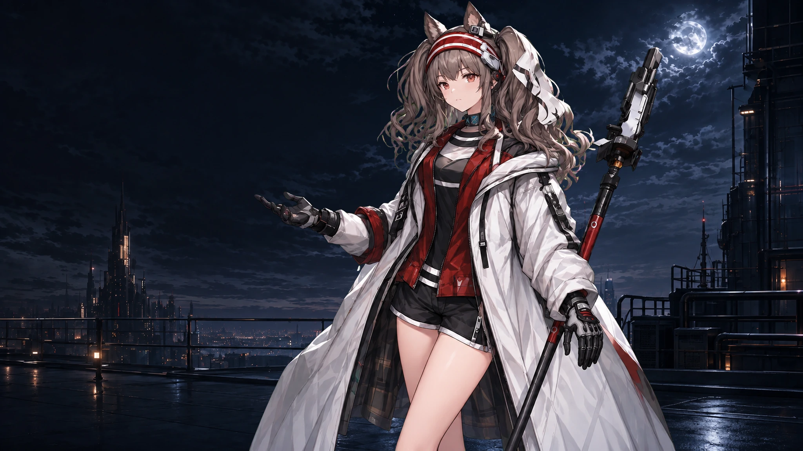

# DeepSeek Harness Angelina Themes

> **本仓库是 fork**，自 [bilbillm/deepseek-harness-angelina-themes](https://github.com/bilbillm/deepseek-harness-angelina-themes) 分叉，为适配 DSH 核心变更而维护。
>
> **改动一（模块重命名适配）**：客户端 store 的模块标识符由 `@deepseek-ai/dsh-client-runtime` 改为 `@deepseek-ai/dsh-client-store`（6 个文件共 8 处）。DSH 核心在 0.1.2 之后不再发布 `dsh-client-runtime`，改由 `dsh-client-store` 提供同一套 store 契约（`defineStore` 等实现逐字节相同），沿用旧标识符会让插件在浏览器端加载失败并报 `Failed to load plugins`。
>
> **改动二（主题持久化修复）**：DSH 宿主只把内建偏好 `light`/`dark`/`system` 写进 `settings.yaml`，第三方主题 id 永远不落盘；同时宿主在设置异步到达后会覆盖内存中的偏好，插件随即把本地记录反向写成 `system`，导致**刷新/重启后主题被重置**。本 fork 改为让皮肤搭在宿主自己的明暗轴上：两份调色板合并成单层 `{light, dark}` token 覆盖表（`ctx.theme.overrideTokens`），不再注册第三方主题 id；亮暗由宿主偏好唯一决定，`localStorage` 只记录"皮肤是否开启"。设置页新增「恢复默认外观」以退回内置外观。
>
> 上游自 2026-08-17 起未再提交，相关报告见上游 [Issue #3](https://github.com/bilbillm/deepseek-harness-angelina-themes/issues/3)，故在此 fork 内自行维护。
>
> 安装：`dsh plugin --profile web add github:famameilin/deepseek-harness-angelina-themes`
>
> 同步上游：`git fetch upstream && git rebase upstream/main`

把 Codex 的安洁莉娜亮色、暗色主题移植到 [DeepSeek Harness](https://github.com/deepseek-ai/deepseek-harness) 的独立 `dsh-plugin`。它保留 Harness 原生的对话布局和控件行为，只把视觉层替换成安洁莉娜主题：背景图、视差、磨砂玻璃、清晰的文字层级，以及在低性能或移动环境下的优雅降级。

<p align="center">
  <a href="https://github.com/bilbillm/deepseek-harness-angelina-themes"></a>
  <a href="https://github.com/bilbillm/deepseek-harness-angelina-themes/blob/main/LICENSE"></a>
  
</p>

English: [README.en.md](README.en.md)

## 先看效果

亮色主题使用清晨屋顶和暖灰色玻璃；暗色主题使用夜景和低亮度冷色玻璃。两种主题都给输入区、菜单、对话框和消息气泡保留足够的背景分离度，文字不会直接压在人物或高对比背景上。

<table>
  <tr>
    <td width="50%"></td>
    <td width="50%"></td>
  </tr>
  <tr>
    <td align="center"><b>Angelina Light</b><br><sub>明亮、偏暖、适合日间长时间工作</sub></td>
    <td align="center"><b>Angelina Dark</b><br><sub>低亮度、偏冷、适合夜间使用</sub></td>
  </tr>
</table>

### 视差分层

背景和人物是两张独立图层：背景不透明，人物带透明通道，指尖移动时远景反向小幅位移、人物正向位移，标题、选择器、输入框和正文保持原位，避免阅读时跟着晃动。

**两套配色共用同一张人物图、同一个锚点位置**，暗色只对这张图做调色（`brightness(0.62) saturate(0.92)`）。这样切换亮/暗时人物不会跳位；先前亮暗各用一张独立人物图，实测切换瞬间人物中心会横向偏移 237px、宽度变化 68px，观感是"换主题把人换了"。

人物层用自己的一套尺寸，不跟背景一起 `cover`：`background-size: auto 72vh` + `background-position: right 32px bottom 0`，即按视口高度定尺寸、挂在右下角；背景层仍用 `cover` 填满整屏。此前人物跟着背景一起 `cover` 缩放，在 929×861 窗口下人物本体高 888px——比窗口还高，头顶被切在画面外。现在的 72vh 让她占窗口高度的 72%，并且这个占比在不同窗口宽高比下保持不变（`vh` 定尺寸 + 角落定位，不像百分比定位那样受窗口形状影响）。

<table>
  <tr>
    <td width="33%"></td>
    <td width="33%"></td>
    <td width="33%"></td>
  </tr>
  <tr>
    <td align="center"><b>Background（亮色）</b><br><sub>城市、天空、屋顶与月光位置</sub></td>
    <td align="center"><b>Character（共用）</b><br><sub>安洁莉娜、信件和前景碎片</sub></td>
    <td align="center"><b>Background（暗色）</b><br><sub>夜景平台、月亮与城市天际线</sub></td>
  </tr>
</table>

## 细节一览

| 区域 | 视觉处理 | 交互边界 |
| --- | --- | --- |
| 新建对话 / 活跃对话 | 共用同一套背景构图和视差层；活跃对话额外使用浅层背景模糊和低透明度 tint | 对话文字、标题、按钮、输入框不参与位移 |
| 顶栏、侧栏、菜单、listbox、dialog | 叶节点磨砂玻璃，不给固定定位的祖先 frame 叠加 `backdrop-filter` | 菜单打开时仍保持清晰的边界和阴影 |
| Composer、输入框、用户消息气泡 | 半透明填充 + 背景模糊 + 轻微饱和度，沿用 Harness 默认形状 | 不改变原生尺寸、键盘行为和按钮布局 |
| 设置页 | 主题选择行、浅色/深色预览、独立持久化选择 | 卸载插件时恢复宿主主题和 `body` 属性 |
| 视差层 | 亮暗共用一张人物图与一个锚点，暗色仅调色；人物按 `72vh` 定尺寸挂在右下角，不随背景 `cover` 放大 | `prefers-reduced-motion`、触摸、窄屏、失焦和页面隐藏时停用或复位 |

<table>
  <tr>
    <td width="50%"></td>
    <td width="50%"></td>
  </tr>
  <tr>
    <td align="center"><b>操作菜单</b><br><sub>半透明底色、细边框和柔和阴影</sub></td>
    <td align="center"><b>排序菜单</b><br><sub>分组标题、选中状态和内容对比度</sub></td>
  </tr>
</table>

### 磨砂玻璃配方

主题把玻璃定义为可复用的 CSS 变量，菜单和设置卡片使用同一套配方，避免出现“顶栏很糊、卡片很硬”或不同浮层透明度不一致的问题。

```css
background: rgba(43, 51, 58, 0.66);
backdrop-filter: blur(18px) saturate(104%);
```

实际应用范围遵循叶节点策略：只给可见的菜单、卡片、输入框和气泡加玻璃，不给 sidebar/frame 祖先加滤镜，因此不会破坏固定定位浮层、滚动容器或对话层级。活跃对话区域使用浅层 `3px` 背景模糊，内部文字和控件保持锐利。

### 视差参数

| 模式 | 背景层 | 人物层 | 设计意图 |
| --- | ---: | ---: | --- |
| 安洁莉娜亮色 | `-5 / -3` | `10 / 6` | 有明显空间感，但不让内容跟着移动 |
| 安洁莉娜暗色 | `-5 / -3` | `10 / 6` | 与亮色完全一致：人物层与锚点共用，位移参数再分叉就等于换模式时挪位置 |

每组两个数依次是 X/Y 位移系数；指针坐标会先按视口归一化到 `-1..1`，数值越大，图层位移越明显。视差容器使用 `pointer-events: none`，不会挡住任何 Harness 控件。

人物层的尺寸与锚点（两套配色共用，不随模式变化）：

```css
background-size: auto 72vh;              /* 占视口高度的 72% */
background-position: right 32px bottom 0; /* 挂在右下角（图层盒四周各外扩 16px，故 32px 落屏为 16px） */
```

## 安装

### GitHub 安装（推荐）

需要 DeepSeek Harness Web profile 和 Node.js 20+。仓库已经提交 `lib/` 构建产物，用户安装时不需要在本机编译插件。

```sh
dsh plugin --profile web add github:famameilin/deepseek-harness-angelina-themes
```

重启 Web profile：

```sh
dsh web
# 或者
npx @deepseek-ai/dsh web
```

打开 `设置 → 通用设置`，在 **安洁莉娜主题** 中选择亮色或暗色。主题选择保存在浏览器本地，刷新或重启后仍会保留。

卸载：

```sh
dsh plugin --profile web remove dsh-angelina-themes
```

### 本地 checkout 安装

适合想马上测试本地改动的情况。 `dsh plugin` 会把相对路径锚定到当前命令目录：

```powershell
cd C:\Users\lumoren\Documents\GitHub\deepseek-harness-angelina-themes
pnpm install
pnpm build
dsh plugin --profile web add .
```

修改 `src/` 后重新运行 `pnpm build`，然后重启 DSH Web profile。当前仓库的 `lib/` 已可直接安装，普通用户不需要执行构建步骤。

## 与 Harness 的兼容策略

- 上游 Harness `0.1.0-rc.6` 只投影活动主题的配色模式和 token，不投影第三方 CSS 选择器需要的主题 id；插件会同步 `body[data-ds-theme]`，卸载时恢复原值。
- `feature/angelina-themes` fork 已经内置主题时，插件先读取 `ctx.theme.getTheme().themes`，复用已有 id，只注册缺失项，避免重复 id。
- fork 如果已经创建 `#dsh-angelina-parallax` 和 `body[data-dsh-angelina-parallax]`，插件不会再创建第二套视差层或指针监听。
- 插件可以和 `dsh-motion`、`dsh-conversation-minimap` 一起安装；主题只负责视觉层，不接管动画插件或会话数据。

## 构建、测试与审计

```sh
pnpm install
pnpm generate-assets
pnpm typecheck
pnpm build
pnpm test
pnpm smoke
```

一次性执行完整检查：

```sh
pnpm verify
```

`src/themes.json` 是唯一的 token 源文件；`src/assets/` 保存可审计的 WebP 素材；生成器把素材嵌入客户端 data URI，因此运行时不依赖第三方图片域名。构建输出为 `lib/index.js`、`lib/client.js` 及对应类型声明。

## 常见问题

**安装后看不到主题选项？** 先确认 profile 是 `web`，再重启 DSH；如果仍未出现，运行 `dsh plugin --profile web why dsh-angelina-themes` 检查依赖是否安装到当前 profile。

**为什么移动端没有视差？** 触摸输入、视口宽度不超过 `900px`、系统开启减少动态效果、页面失焦或隐藏时都会停用/复位视差。这是为了保持可读性、续航和触控稳定性。

**为什么选择内置浅色/深色后安洁莉娜主题消失？** 这是预期行为。切回 Harness 内置主题会把插件选择标记恢复为 `system`，不会覆盖宿主的主题设置；之后可以再次选择安洁莉娜亮色或暗色。

## 许可证与素材

代码和元数据按 MIT 发布。安洁莉娜、《明日方舟》及相关原作、美术和商标权利归各自权利人所有。本项目为非官方同人定制，不代表 DeepSeek、OpenAI、鹰角网络、悠星或《明日方舟》。

素材来源与第三方声明见：[ASSET-PROVENANCE.md](ASSET-PROVENANCE.md) · [THIRD-PARTY-NOTICES.md](THIRD-PARTY-NOTICES.md)
